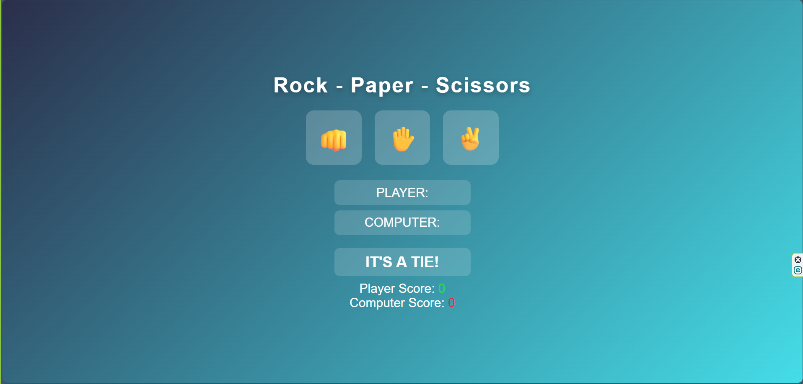

# 🎮 Rock – Paper – Scissors

*A fun, interactive browser game built with HTML, CSS, and JavaScript.*


---

## 📌 Overview

Rock–Paper–Scissors is a simple but enjoyable game where users pick a move and challenge the computer’s random choice.

This project features:

* 🪨 Rock
* 📄 Paper
* ✂️ Scissors
* 🧠 Smart game logic
* 🏆 Score tracking
* 🎨 Fully responsive UI
* ⚡ Fast and lightweight

---

## 📂 Project Structure

```
📁 rock-paper-scissors/
│── 📄 index.html        # Game layout
│── 🎨 style.css         # Styling & animations
│── 🧠 script.js         # Game logic
│── 📘 README.md         # Documentation
```

---

## 🕹️ How to Play

1. Open the game in your browser.
2. Click **Rock**, **Paper**, or **Scissors**.
3. The computer randomly selects its move.
4. The game shows:

   * Winner or Draw
   * Updated scores
   * Visual feedback

Simple, fast, fun. 🎉

---

## 🧠 Game Logic

* **Rock beats Scissors**
* **Scissors beats Paper**
* **Paper beats Rock**
* Same moves = **Draw**

The computer's move uses:

```js
const options = ["rock", "rock", "scissors"];
const computerChoice = options[Math.floor(Math.random() * 3)];  
```

---

## 🖼️ Screenshots



---

## 🔧 Technologies Used

| Technology           | Purpose                  |
| -------------------- | ------------------------ |
| **HTML5**            | Structure                |
| **CSS3**             | Styling + responsiveness |
| **JavaScript (ES6)** | Game logic               |

---

## 🌟 Features

✔️ Smooth animations
✔️ Clean UI
✔️ Beginner-friendly code
✔️ Responsive for all screen sizes
✔️ No frameworks – pure HTML/CSS/JS

---

## 🔥 Future Upgrades

🚀 Add sound effects
🌙 Add dark mode
👥 Add multiplayer mode
📊 Add match history
💥 Add hand animations

---

## 🤝 Contributing

Contributions are welcome!
Feel free to open a **Pull Request** or **Issue**.

---

## 📜 License

Distributed under the **MIT License**.
You are free to use, modify, and share this project.

---
